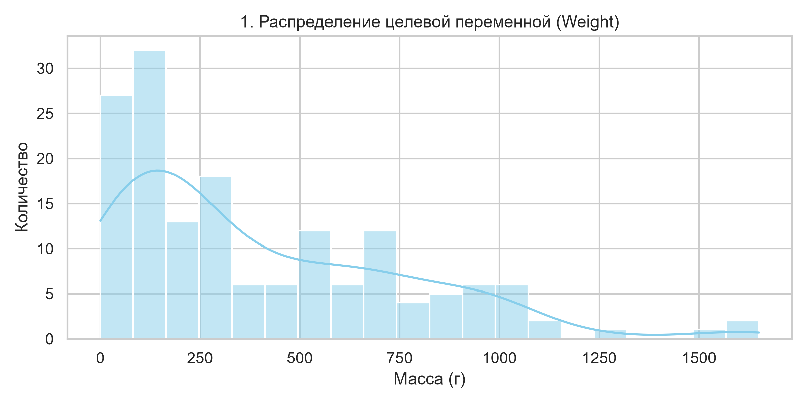
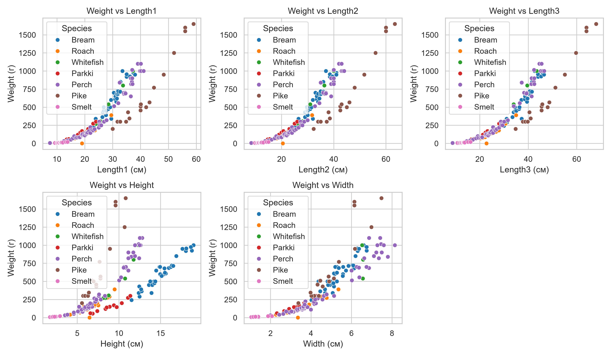
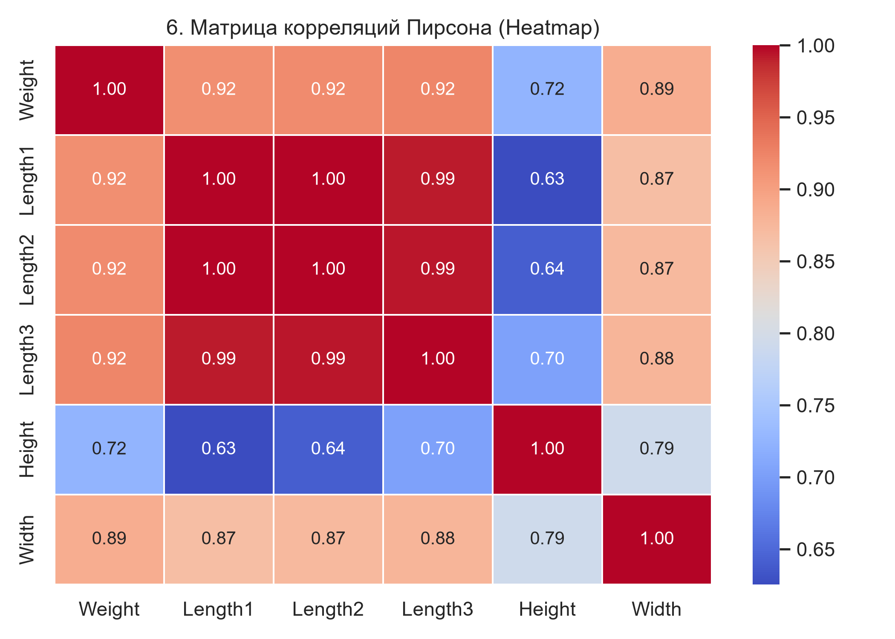
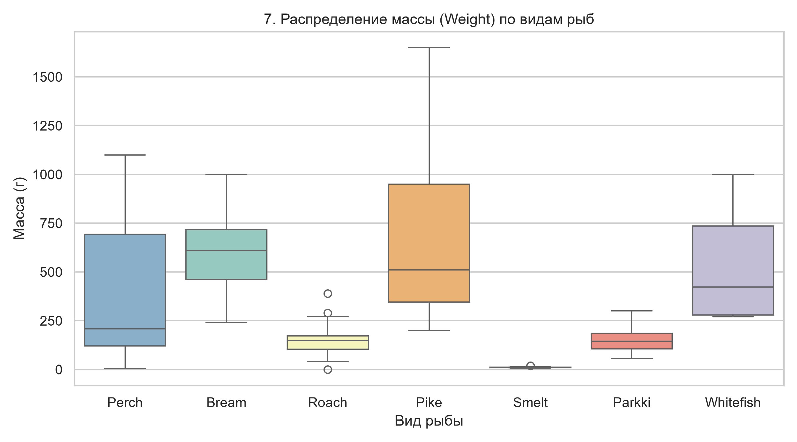
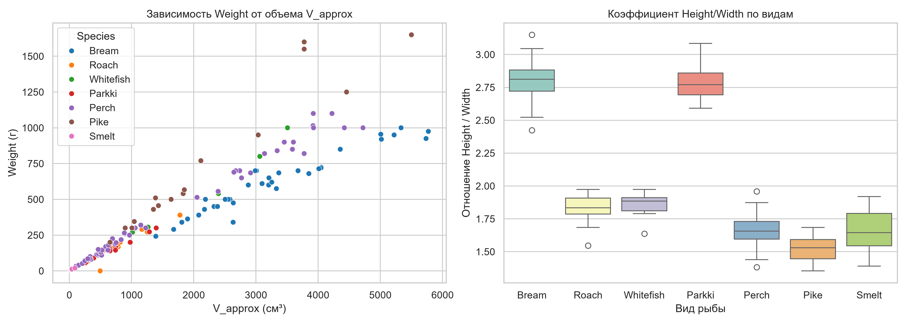

# Отчет по лабораторной работе №1
## Анализ данных и подготовка признаков: Датасет «Fish Measurements»

**Дисциплина**: Введение в искусственный интеллект  
**Студент**: Снопов Максим Александрович
**Группа**: 22205 
**Ветка Git**: `lab/01-eda`  
**Исходный репозиторий**: https://github.com/tylerrussin/Fish-Dimensions-Regression-Analysis  
**Исходный коммит**: `1f65547b63c3043e2dcfff0c6435afa993331d4e`  
**Ключевые библиотеки**: pandas 3.0.5, numpy 2.5.3, matplotlib 3.11.2, seaborn 0.13.2, statsmodels, scikit-learn
---

### 1. Паспорт датасета

* **Название датасета**: `Fish.csv` (размерности рыбы и её масса).
* **Размерность**: 159 строк, 7 столбцов.
* **Целевая переменная**: `Weight` (масса рыбы в граммах, непрерывная количественная переменная).
* **Тип задачи**: Регрессия (Supervised Machine Learning / Regression).
* **Входные признаки**:
  * `Species` (категориальный) — вид рыбы (7 уникальных категорий).
  * `Length1` (количественный) — вертикальная длина (см).
  * `Length2` (количественный) — диагональная длина (см).
  * `Length3` (количественный) — полная анатомическая длина (см).
  * `Height` (количественный) — высота тела (см).
  * `Width` (количественный) — диагональная ширина тела (см).

---

### 2. Первичный анализ и целостность данных

1. **Пропуски**: Отсутствуют по всем 7 столбцам (полнота данных 100%).
2. **Типы данных**: Строковый `object` для `Species`, числовой `float64` для всех остальных параметров.
3. **Дубликаты**: Полные идентичные строки в файле отсутствуют.

---

### 3. Статистический анализ аномалий и выбросов (IQR и MAD)

Вычисление межквартильного размаха (**IQR**) и устойчивой Z-оценки (**MAD**) выявило две группы аномалий:

* **Техническая ошибка записи (Строка index 40)**:
  * `Species`: *Roach*, `Weight`: $0.0$ г при нормальных габаритах (`Length1-3` $\approx 19 \text{–} 22$ см).
  * *Решение*: **Удалить строку** из выборки перед передачей в модели (явный брак при сборе данных).
* **Естественные биологические экстремумы (Строки index 142, 143, 144)**:
  * Крупные щуки (*Pike*) массой 1250–1650 г и длиной 55–60 см.
  * *Решение*: **Оставить без изменений**. Физические пропорции гармоничны, удаление усечет верхнюю границу и ухудшит обобщающую способность модели.

---

### 4. Результаты визуального анализа (EDA)

#### 4.1. Распределение целевой переменной

* **Вывод**: Распределение массы `Weight` сдвинуто влево. Большинство рыб весят до 500 г, крупных особей более 1000 г крайне мало.

#### 4.2. Распределение признаков размеров

* **Вывод**: Линейные размеры имеют многовершинные формы распределения из-за смешения 7 раздородных биологических видов.

#### 4.3. Соотношение видов рыб

* **Вывод**: В данных присутствует явный дисбаланс видов: окунь (*Perch*) занимает 35% датасета (56 шт.), а белая рыба (*Whitefish*) всего 3.7% (6 шт.).

#### 4.4. Связь массы с линейными размерами

* **Вывод**: На всех 5 графиках точки образуют загнутую дугу. Рост массы относительно длин нелинейный (кубический: $W \propto L^3$), так как рыба растет во всех трех измерениях.

#### 4.5. Взаимное распределение признаков (Pairplot)

* **Вывод**: Виды рыб образуют наглядные обособленные кластеры благодаря уникальным анатомическим пропорциям тела.

#### 4.6. Тепловая карта корреляций

* **Вывод**: Измерения `Length1`, `Length2` и `Length3` коррелируют между собой с коэффициентом $r > 0.995$. Это дублирование создает сильную мультиколлинеарность.

#### 4.7. Распределение массы по видам

* **Вывод**: Самые крупные и вариативные по массе виды — *Pike* (щука) и *Bream* (лещ), а самый мелкий и легкий вид — *Smelt* (корюшка).

#### 4.8. Проверка признаковых гипотез

* **Вывод**: Перемножение измерений убрало кубический изгиб зависимости массы, а отношение `Height/Width` четко разделило плоских и круглых рыб.

---

### 5. Признаковый инжиниринг и гипотезы (Feature Engineering)

1. **Синтетический объем ($V_{\text{прибл}}$)**:
   * **Формула**: $V_{\text{прибл}} = \text{Length3} \cdot \text{Height} \cdot \text{Width}$.
   * **Эффект**: Зависимость массы от объема стала прямой (линейной), корреляция выросла с **0.9230** до **0.9586**.
2. **Пропорции тела (`Height_Width_Ratio`)**:
   * **Формула**: $\text{Height} / \text{Width}$.
   * **Эффект**: Отражает тип телосложения (лещ — 2.32 vs корюшка — 1.18).
3. **Борьба с мультиколлинеарностью**:
   * Исключены дублирующие столбцы `Length1` и `Length2`. Оставлена только полная длина `Length3`.
4. **Кодирование категорий (`Species`)**:
   * Категориальный признак кодируется через **One-Hot Encoding**. При появлении неизвестного вида OHE установит нули, а модель сделает предсказание по физическому признаку $V_{\text{прибл}}$.

---

### 6. Схема разбиения выборки и реестр утечек данных (Data Leakage)

* **Стратегия**: Выборка разделена в пропорции **70% Train / 15% Val / 15% Test** с применением **стратификации** по виду `Species`.

#### Таблица контроля каналов утечки данных

| № | Канал утечки | Статус в проекте | Способ предотвращения |
|---|---|---|---|
| 1 | **Статистики всей таблицы** | Исключена | Все масштабирования и расчеты статистик выполняются только на `Train`. |
| 2 | **Повторные строки** | Исключена | Дубликаты в `Fish.csv` отсутствуют. |
| 3 | **Идентификаторы (ID)** | Исключена | Порядковые индексы строк удалены из матрицы $X$. |
| 4 | **Постфактум измерение** | Исключена | Переменная `Weight` строго изолирована от расчетов признаков. |
| 5 | **Ручной подбор по тесту** | Исключена | Гиперпараметры подбираются на `Validation`. Выборка `Test` оценивается 1 раз на финише. |